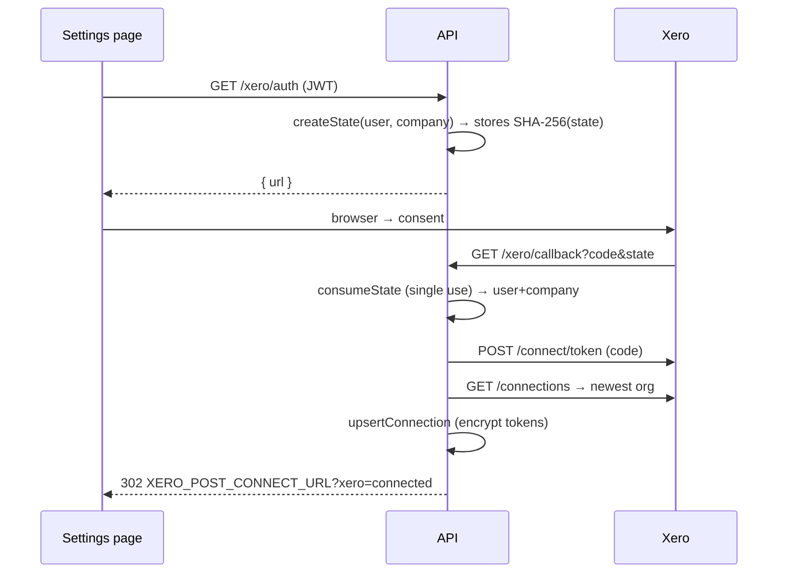
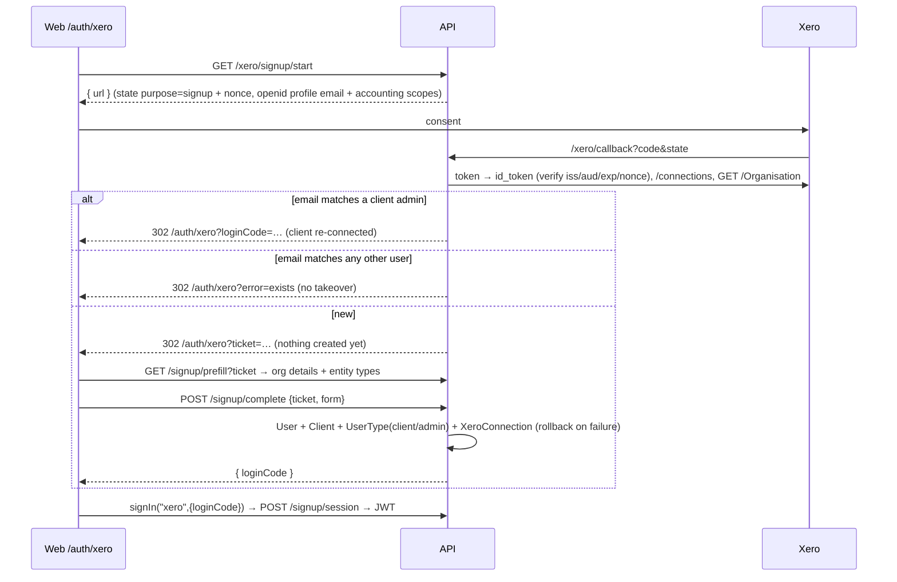

# Xero integration — developer guide

Read this first if you are going to change, debug or extend the Xero integration.
(`README.md` is the setup/ops reference; this is the "how it works and why" guide.)

**Contents**
1. [The 60-second mental model](#1-the-60-second-mental-model)
2. [Where things live](#2-where-things-live)
3. [Data model](#3-data-model)
4. [Flows](#4-flows) — connect · tokens · sync · webhooks · sign up with Xero
5. [Run it locally](#5-run-it-locally)
6. [API cheat-sheet (curl)](#6-api-cheat-sheet)
7. [Recipes — common changes](#7-recipes)
8. [Rules that will bite you](#8-rules-that-will-bite-you)
9. [Testing](#9-testing)
10. [Debugging & runbook](#10-debugging--runbook)
11. [Security model](#11-security-model)
12. [Frontend (dooit-finance-web)](#12-frontend)

---

## 1. The 60-second mental model

```
                         ┌────────────────────────────────────────────┐
  Browser ──────────────▶│  routes/xero.js  →  controllers/xeroController
                         └───────┬────────────────────────────────────┘
                                 │ thin: validate, call a service, shape JSON
                                 ▼
        ┌──────────────── services/xero/ ─────────────────────┐
        │ oauth ─ tokenService ─ client      (talk to Xero)    │
        │ mappers                           (pure: Dooit⇄Xero) │
        │ syncService                       (idempotent push/pull)
        │ jobQueue + webhook                (async work)       │
        │ signupService                     ("Sign up with Xero")
        └───────────┬───────────────────────────┬─────────────┘
                    ▼                           ▼
              Mongo (7 collections)        Xero (identity, connections, accounting API)
```

Three ideas carry the whole design:

1. **One company ↔ one Xero organisation.** `XeroConnection.companyId` is the Dooit `Client` (tenant); `tenantId` is the Xero org. Every sync is scoped to that pair.
2. **Idempotency by link table + hash.** `XeroEntityLink` remembers `Dooit id → Xero id` and the hash of the last payload we pushed. Re-running a sync never duplicates anything and never re-sends unchanged data.
3. **Nothing slow happens in a request.** Webhooks and "Sync Now" only write a `XeroJob`; a Mongo-backed worker does the work with retries.

Tokens are the sensitive part: refresh tokens are **single-use** at Xero, stored **encrypted**, and refreshed through **one choke point** (`tokenService`). Nothing else touches them.

---

## 2. Where things live

### API repo (`dooit-finance-api`)

| File | Responsibility |
|---|---|
| `config/xero.js` | Reads `XERO_*` env, `validateXeroConfig()` (never throws; disables the integration on bad config) |
| `routes/xero.js` | Route table + middleware order (webhook raw-body → public → signup → auth+RBAC) |
| `controllers/xeroController.js` | HTTP layer only. Callback branches on `state.purpose` |
| `services/xero/http.js` | `send()` / `sleep()` — the **only** place axios is called. Mock this in tests |
| `services/xero/oauth.js` | State create/consume, authorize URL, code exchange, `/connections`, id_token validation |
| `services/xero/tokenService.js` | `getAccessToken`, `refreshAccessToken`, rotation, revoke handling |
| `services/xero/client.js` | `request()` (the one request helper) + `getContacts/createContact/…`, `connect`, `disconnect`, `upsertConnection` |
| `services/xero/mappers.js` | Pure functions: customer/company/invoice/payment ⇄ Xero, org → signup prefill |
| `services/xero/syncService.js` | `pushContact/pushInvoice/pushPayment`, `runOutbound`, `runInbound`, `runSync` |
| `services/xero/jobQueue.js` | `enqueue`, `processNext`, scheduler, `startXeroWorker` |
| `services/xero/webhook.js` | Signature verification + event → job intake |
| `services/xero/signupService.js` | Sign up / sign in with Xero |
| `services/xero/syncLog.js` | `logSync()` (audit rows) and `hashPayload()` |
| `models/Xero*.js` | See §3 |
| `tests/xero/` | Jest suites, no MongoDB needed |

> The service layer is `services/xero/` (not `lib/xero/`) to match `services/billing/`.

### Web repo (`dooit-finance-web`)

| File | Responsibility |
|---|---|
| `app/dashboard/client/system-settings/xero/{page.js,actions.js}` | Settings route + server actions (`fetchWithAuth`) |
| `views/xero/index.jsx` | Settings card: connect / sync / disconnect / errors |
| `app/auth/xero/{page.js,actions.js}` | Public sign-up landing + server actions |
| `views/auth/xero/index.jsx` | Pre-filled signup form, auto sign-in |
| `auth.js` | NextAuth `xero` credentials provider (redeems the login code) |
| `components/login-form.jsx` | "Continue with Xero" button |

---

## 3. Data model

```
Client (tenant) 1 ──── 0..1 XeroConnection ──── tenantId ──┬── * XeroEntityLink
User ── UserType(client/admin, clientBelongs) ──┘            ├── * XeroJob
                                                              └── * XeroSyncLog
XeroOAuthState (10 min) ── XeroSignup (1 h)         ← short-lived OAuth / signup plumbing
```

| Collection | Purpose | Key facts |
|---|---|---|
| `XeroConnection` | The authorised org for a company | `refreshToken`/`accessToken` are **ciphertext + `select:false`**; `toJSON` deletes them. Partial-unique indexes: one `connected` row per `companyId` and per `tenantId`. Holds `lastSync*` fields the UI shows |
| `XeroEntityLink` | External-ID map | Unique `(tenantId, entityType, localId)` **and** `(tenantId, entityType, xeroId)`. `payloadHash` = hash of last pushed payload. `entityType ∈ customer\|company\|invoice\|payment` |
| `XeroSyncLog` | Append-only audit/sync log | `entity, action, direction, status, error, payloadHash, actor`. **Never** tokens or bodies. 1-year TTL |
| `XeroJob` | Work queue | `status: queued→running→done\|dead`. Partial-unique `dedupeKey` while queued/running. `done` rows expire after 30 days |
| `XeroOAuthState` | One-time CSRF state | Stores SHA-256 of state. `purpose: connect\|signup`, `nonce` for signup. 10-min TTL |
| `XeroSignup` | Sign-up bridge | Hashed ticket + login code, encrypted Xero tokens, `prefill`. 1-h TTL |

Existing Dooit models are **read** (Client, Customer, Invoice, Payment) and, for inbound changes, narrowly **written** (see §8 rules 6–7). `Customer` PII is role-encrypted; sync code must treat `"***"`/ciphertext as "absent".

---

## 4. Flows

### 4.1 Connect (logged-in admin)



The callback has **no auth header** (it's a browser redirect). Identity comes only from the one-time `state`.

### 4.2 Tokens — `tokenService`

```
getAccessToken(id)
  ├─ memory cache fresh?  → return
  ├─ DB access token fresh (>60s left)? → decrypt, cache, return
  └─ refreshAccessToken(id)            ← serialised per connection (promise map)
        POST /connect/token (refresh_token)
        ├─ 200  → CAS-update stored ciphertext (only if unchanged) → rotated + expiry recalculated
        ├─ invalid_grant → another instance may have rotated? reuse its token : mark connection `revoked`
        └─ other → 502
```
`client.request()` adds: one refresh+retry on 401, `Retry-After` back-off on 429 (≤60 s, 2 tries), network/5xx retry (2 tries), and error mapping (`400→ErrorResponse`, duplicate contact → `err.code = "DUPLICATE_CONTACT"`).

### 4.3 Sync — `syncService.runSync(connectionId, {full})`

```
claim connection (lastSyncStatus=running; reclaims runs stale >30 min)
  runOutbound:  company contact → customers → invoices → payments
  runInbound:   linked contacts (If-Modified-Since) → linked invoices (+ their payments)
  write summary + cursors, status success|partial|failed
```
Per entity the push is always the same shape:

```js
payload = mapper(entity)                 // pure
hash    = hashPayload(payload)
link    = XeroEntityLink(tenant, type, id)
if (link && link.payloadHash === hash) → skip            // no API call
link ? update(link.xeroId) : create()                    // duplicate-name → adopt existing
save link {xeroId, payloadHash}; logSync(...)
```

| Dooit | → Xero | Notes |
|---|---|---|
| `Client` | Contact | `AccountNumber = DOOIT-K-<last8 id>` |
| `Customer` (individual) | Contact | skipped if no usable name |
| `Invoice` (not draft) | ACCREC Invoice | `LineAmountTypes: NoTax`; Dooit discount/tax lines sent as lines so totals match to the cent |
| `Payment` (`paid`, `payment`) | Payment | needs `XERO_PAYMENT_ACCOUNT_CODE` and the invoice already in Xero; refunds skipped |

Inbound: contact name/email/phone → `Client` (and plaintext-only `Customer` fields), last-writer-wins on `UpdatedDateUTC`; Xero payments on linked invoices → new Dooit `Payment` (`gateway:"xero"`, `transactionId:"xero:<id>"`) then `reconcileInvoice()`; a Xero VOID is **logged, not applied**.

**Queue:** `enqueue(type, {...dedupeKey})` → worker polls every 15 s, atomically claims (`findOneAndUpdate`), runs. Failure → back to `queued` with `nextRunAt = now + 30s·2^(attempts-1)`; `dead` after `XERO_JOB_MAX_ATTEMPTS` or on 401/409. Jobs stuck `running` >15 min are recovered. A scheduler enqueues an incremental sync per connection every `XERO_SYNC_INTERVAL_MIN` (deduped per window).

### 4.4 Webhooks

```
POST /xero/webhook  (express.raw → Buffer)
  verifySignature(rawBytes, x-xero-signature)  — HMAC-SHA256/base64, timingSafeEqual
  ├─ bad/missing → 401, empty body, log, STOP
  └─ ok → processPayload: per event → find connection → enqueue inbound_event (dedupeKey)
          → 200, empty body            (must be < 5 s: no Xero calls here)
worker: inbound_event → fetch resource → applyInboundContact | applyInboundInvoice
```

### 4.5 Sign up with Xero


Why a ticket/loginCode instead of creating the account in the callback: the user gets to review the pre-filled form, and the browser never sees tokens. Both are 256-bit, hashed at rest, single-use (30 min / 2 min).

---

## 5. Run it locally

1. Create a Xero **demo company** and a Xero app (Web app). Add scopes: `offline_access accounting.contacts accounting.transactions accounting.settings openid profile email`.
2. Expose your API over HTTPS (Xero requires https except `localhost` redirects): `ngrok http 6830` → `https://abc.ngrok.app`.
3. API env (`config/config.env`):
   ```
   XERO_CLIENT_ID=…            XERO_CLIENT_SECRET=…
   XERO_REDIRECT_URI=https://abc.ngrok.app/api/v1/xero/callback
   XERO_WEBHOOK_KEY=…          XERO_PAYMENT_ACCOUNT_CODE=090
   XERO_POST_CONNECT_URL=http://localhost:8001/dashboard/client/system-settings/xero
   XERO_SIGNUP_URL=http://localhost:8001/auth/xero
   ENCRYPTION_KEY=<64 hex>     # already required by the app
   ```
4. Register the same redirect URI and a webhook URL `https://abc.ngrok.app/api/v1/xero/webhook` in the Xero app; copy the signing key into `XERO_WEBHOOK_KEY`.
5. `npm run dev` — look for `[xero] background worker started`. Log in as a client admin → *System Settings → Xero → Connect*.
6. Tail activity: `GET /api/v1/xero/logs?limit=50`, or query `xerosynclogs` / `xerojobs` in Mongo.

Disabled quietly if no `XERO_*` is set; bad config logs `[xero] config error:` and disables it without stopping the API.

---

## 6. API cheat-sheet

Base `/api/v1/xero` (also mounted at `/api/xero`). `$T` = a client-admin JWT.

```bash
# status / connect / sync / disconnect
curl -H "Authorization: Bearer $T" $API/xero/status
curl -H "Authorization: Bearer $T" $API/xero/auth                    # → {data:{url}}
curl -X POST -H "Authorization: Bearer $T" $API/xero/sync            # 202; duplicate clicks collapse
curl -X POST -H "Authorization: Bearer $T" $API/xero/disconnect
curl -H "Authorization: Bearer $T" "$API/xero/logs?status=failed"

# Dooit staff must name the company:  …/xero/status?companyId=<clientId>

# webhook (sign the EXACT bytes you send)
BODY='{"events":[],"firstEventSequence":0,"lastEventSequence":0}'
SIG=$(printf %s "$BODY" | openssl dgst -sha256 -hmac "$XERO_WEBHOOK_KEY" -binary | base64)
curl -i -X POST $API/xero/webhook -H "Content-Type: application/json" -H "x-xero-signature: $SIG" -d "$BODY"   # 200
curl -i -X POST $API/xero/webhook -H "x-xero-signature: bad" -d "$BODY"                                          # 401
```

Errors use the app's normal shape: `{ "success": false, "error": "message" }`.
Meaningful statuses: `401` revoked/expired Xero access (reconnect) · `403` not an admin / missing scope · `409` not connected / org already used / account exists · `410` signup link expired · `429` Xero rate limit · `503` Xero unreachable · `503` also when the integration isn't configured.

---

## 7. Recipes

### Sync a new entity type (e.g. credit notes)
1. **Mapper** in `mappers.js` — pure `x → payload | null` (return `null` for "can't/shouldn't sync"). Add a mapper test.
2. **Client function** in `client.js` (`createCreditNote`…) using `request()`.
3. **Link type:** add to `entityType` enum in `models/XeroEntityLink.js`.
4. **Push function** in `syncService.js` copying `pushContact`'s shape (hash → link → create/update → `saveLink` → `logSync`). Return `{action}` so `tally()` works.
5. **Wire** into `runOutbound` (respect dependency order) and add a key to `emptySummary()`.
6. **Test** duplicate prevention like `tests/xero/sync.test.js`.
7. If Xero emits a webhook category for it, add it to `SUPPORTED` in `webhook.js` and a branch in `jobQueue.handleInboundEvent`.

### Add a Xero API call
Always go through `request(connection, {method, path, params, data})`. Don't call axios; don't fetch tokens yourself.

### Change scopes
Set `XERO_SCOPES` (space/comma list; `offline_access` is forced). Existing connections keep their old scopes until the user reconnects — a `403` from Xero with a scope message means "ask them to reconnect".

### Change what the signup form pre-fills
`mappers.organisationToClientPrefill` (what Xero provides) and `signupService.FORM_FIELDS` (what the user may submit — a whitelist; add here deliberately). Add the input on the web view.

### Require email verification for Xero signups
In `signupService.completeSignup` set `isActive:false` on the new `User`, send the existing OTP (`Otp` model, see `authController.register`), and gate `redeemLoginCode` on `user.isActive`.

---

## 8. Rules that will bite you

1. **Refresh tokens are single-use.** Never call the token endpoint outside `tokenService`/`oauth`. Two parallel refreshes = a dead connection.
2. **Never log or return tokens.** `XeroConnection` strips them in `toJSON`; keep it that way. Sync logs store a *hash*, not payloads.
3. **Webhook needs the raw body.** `express.raw` is mounted on that route *before* any `express.json()`. Re-parsing then re-stringifying breaks the signature.
4. **Don't call Xero inside the webhook handler** (5-second deadline) — enqueue only.
5. **Changing a mapper changes hashes** → every entity looks "changed" once and is re-sent. That's safe (update, not create) but plan for the API quota (60/min/org).
6. **Customer PII may be encrypted at rest.** Outbound: `clean()` drops `"***"`/ciphertext. Inbound: write via the raw collection and skip fields that `looksEncrypted`. Never overwrite ciphertext with plaintext.
7. **Invoices are immutable once issued** and voiding is a human action (releases usage). Inbound Xero voids are logged, not applied. Payments from Xero are written as `Payment` docs then `reconcileInvoice()` — don't set invoice status directly.
8. **`NoTax` line mode is deliberate.** Dooit already computed tax/discount; letting Xero recompute makes totals drift.
9. **`asyncHandler` doesn't return its promise** — in controller unit tests wait on `res`/`next`, not on the handler (see `oauth.test.js`).
10. **One `connected` row per company and per org** is enforced by partial-unique indexes; `upsertConnection` also pre-checks to give a friendly 409.
11. **Dedupe keys are your idempotency.** Use them for anything that can be redelivered/double-clicked (`full:<tenant>`, `wh:<tenant>:<cat>:<id>:<ts>`, `incr:<tenant>:<window>`).
12. **Signup identity policy:** the account email is always the Xero email; the form can't change it. Don't widen `FORM_FIELDS` to include `email`, `status`, `user`.

---

## 9. Testing

```bash
npm run test:xero        # 72 tests, ~2 s, no MongoDB
```
Approach: external boundaries are mocked, not the code under test —
`services/xero/http` (axios) and the Mongoose models via the in-memory `tests/xero/fakes.js`. Env is set in `tests/xero/setup.js`.

| Suite | Covers |
|---|---|
| `oauth.test.js` | State single-use, authorize URL, callback controller |
| `token.test.js` | Refresh/rotation/encryption/expiry, 401-retry-once, 429, network, duplicate-contact |
| `mappers.test.js` | Customer/company/invoice/payment mapping, masked-PII, totals parity |
| `webhook.test.js` | Signature (good/bad/missing), 401/200 behaviour, dedupe, unsupported events |
| `sync.test.js` | Duplicate prevention, adopt-on-duplicate, no payment echo |
| `signup.test.js` | id_token checks, prefill, ticket/loginCode single-use & expiry, rollback, takeover guard |

Not covered (needs a real DB / Xero): index behaviour, the worker loop timing, real Xero payload acceptance. Before a release, run one connect → Sync Now → webhook → disconnect pass against a demo company.

Adding a test: mock `http.send` with `mockResolvedValueOnce({status, data, headers})`; assert on the *request* (`http.send.mock.calls[0][0]`) and on rows in the fake stores.

---

## 10. Debugging & runbook

| Symptom | Look at |
|---|---|
| UI shows "Reconnect required" | `XeroConnection.status` = `revoked` (refresh failed `invalid_grant`). User reconnects; nothing to fix server-side |
| Sync "stuck running" | Self-clears after 30 min. Check `xerojobs` where `status:"dead"` → `lastError` |
| Item not in Xero | `xerosynclogs` for that `entityId`: `skipped` rows carry the reason (no name / no payment account / invoice not synced) |
| Same item re-sent every sync | Mapper output isn't deterministic (e.g. a timestamp inside the payload). Hash must be stable |
| Webhook intent-to-receive fails | Wrong `XERO_WEBHOOK_KEY`, or a proxy rewrote the body / dropped the header |
| `?xero=invalid_state` | State consumed/expired (10 min) or API and web point at different databases |
| Signup `exists` error | Email already belongs to a non-client-admin user — they should log in and use *Settings → Xero → Connect* |
| 403 from Xero | Scope missing on this connection → reconnect (see Change scopes) |
| 429 storms | Lower sync frequency (`XERO_SYNC_INTERVAL_MIN`); the client already backs off on `Retry-After` |

Useful queries:
```js
db.xerosynclogs.find({tenantId:"<t>", status:"failed"}).sort({timestamp:-1}).limit(20)
db.xerojobs.find({status:{$in:["queued","running","dead"]}})
db.xeroconnections.findOne({companyId:ObjectId("…")})        // tokens are not returned (select:false)
db.xeroentitylinks.find({tenantId:"<t>", entityType:"invoice"})
```
To force a clean re-push of one entity: delete its `XeroEntityLink` **only if** the Xero record was also removed (otherwise you'll create a duplicate; the contact path will adopt by name, invoices will not).

---

## 11. Security model

| Concern | How it's handled |
|---|---|
| Refresh tokens | AES-256-GCM (`utils/encryption`, `ENCRYPTION_KEY`), `select:false`, stripped from JSON, rotated on every refresh |
| OAuth CSRF | 256-bit single-use state stored hashed, bound to user+company, 10-min TTL |
| OIDC | id_token `iss`, `aud`, `exp`, `nonce` enforced (signature check skipped per OIDC Core §3.1.3.7 because the token comes direct from Xero's token endpoint over TLS) |
| Webhook auth | HMAC-SHA256 over raw bytes, constant-time compare, 401 on failure |
| RBAC | `protect` + `authorizeUserType(client,branch,dooit)` + `authorize("admin")`; tenant pinned to the caller's company (dooit staff pass `companyId`) |
| Public endpoints | rate-limited (60/15 min/IP); each step needs a one-time secret |
| Account takeover | signup refuses emails belonging to non-client-admin users; account email = Xero email |
| Caching/headers | `Cache-Control: no-store` on all Xero routes; `helmet` global |
| Audit | every connect/refresh/disconnect/sync/webhook/signup → `XeroSyncLog` with actor |
| Transport | https redirect/webhook URLs required (config validation rejects non-https except localhost) |

---

## 12. Frontend

Repo: `dooit-finance-web`. Patterns used: server actions over `fetchWithAuth` (so the JWT never reaches client JS), thin `page.js` + `views/` component, shadcn/`sonner`.

* **Settings card** (`/dashboard/client/system-settings/xero`): polls `GET /xero/status` every 2.5 s while `syncing`; disables Sync Now while a sync is queued/running; shows org, connected date, last sync, per-entity counts, errors; Disconnect behind a confirm dialog; reconnect button on `revoked`. Reads `?xero=` after the OAuth callback and toasts the result.
* **Sign up page** (`/auth/xero`, public via the `/auth` prefix in `middleware.js`): no params → starts the flow (works as the App Store launch link); `?ticket` → pre-filled form; `?loginCode` → `signIn("xero", {loginCode})` then `/dashboard/client`; `?error` → message + retry.
* **NextAuth:** `auth.js` has a second Credentials provider `xero` that redeems the login code at `POST /xero/signup/session` and returns the same user shape as password login, so the rest of the app can't tell the difference.
* Single-use secrets and React StrictMode: the views guard their on-mount calls with a `useRef` so a dev double-render doesn't burn a ticket/login code.

Env contract between the repos: API `XERO_POST_CONNECT_URL` → the Settings page URL; API `XERO_SIGNUP_URL` → `/auth/xero`; web `NEXT_PUBLIC_API_BASE_URL` → `…/api/v1/`.
